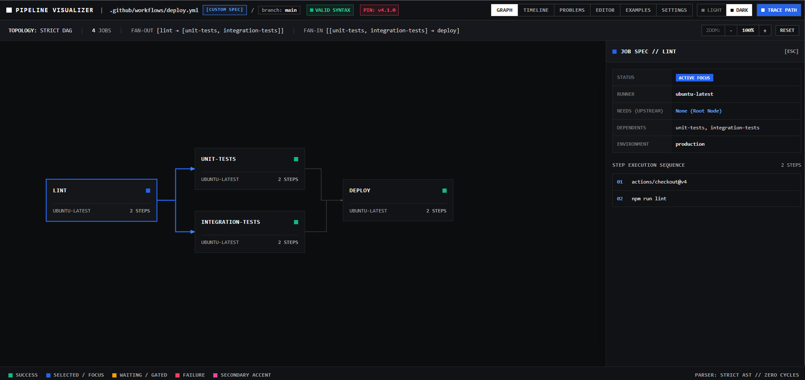
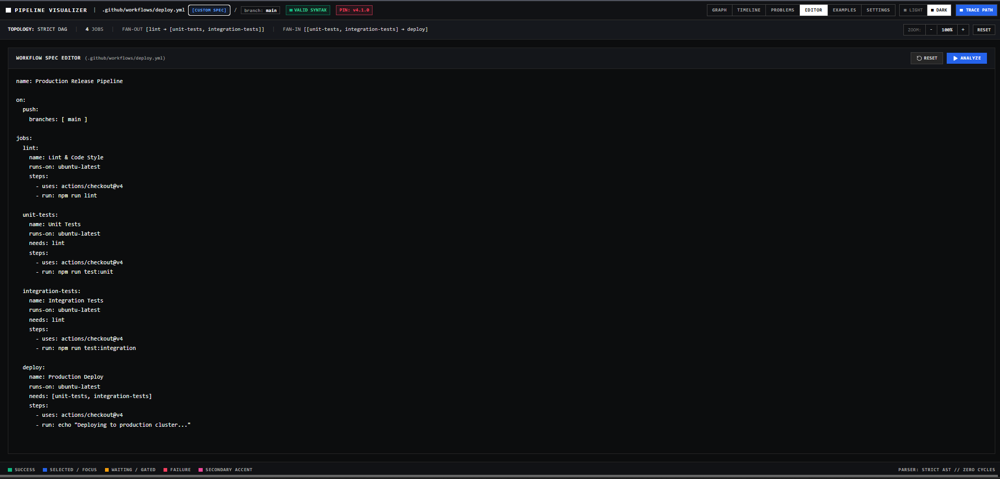
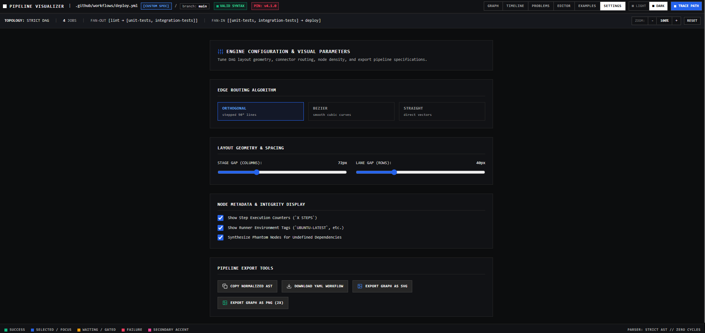
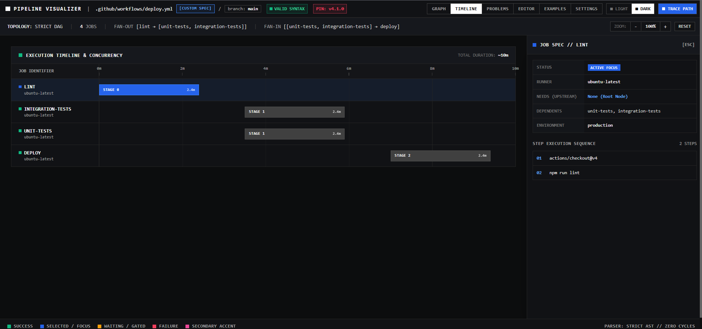

# Pipeline Visualizer

A deterministic, high-performance DAG visualizer, editor, and analysis workstation purpose-built for **GitHub Actions** CI/CD workflows.

Pipeline Visualizer parses GitHub Actions workflow YAML into a normalized workflow model, analyzes job dependencies, detects structural problems, renders interactive execution graphs, provides job-level inspection, simulates pipeline execution, and exports workflow diagrams.

> **Scope:** Pipeline Visualizer currently supports **GitHub Actions workflows only**.

---

## Visual Tour

### DAG Graph View

Explore GitHub Actions job dependencies through an interactive execution graph with sequential stages, parallel branches, fan-out/fan-in relationships, job inspection, and dependency tracing.



### Live Workflow Editor

Edit or paste GitHub Actions workflow YAML directly inside the application. The workflow is parsed and analyzed without requiring an external CI/CD system.



### Settings & Export

Configure graph presentation and export the generated workflow graph as SVG or PNG for documentation and sharing.



### Execution Timeline

View the workflow as a staged execution timeline to understand job ordering, parallel execution, waiting states, and pipeline progression.



---

## Key Features

- **GitHub Actions Workflow Parsing** — Parses workflow YAML including jobs, `needs` dependencies, runner information, matrix configuration, and job steps.
- **Normalized Workflow Model** — Converts parsed workflow data into a structured internal representation used by the graph, analysis, and timeline layers.
- **DAG Analysis** — Builds a directed dependency graph and analyzes execution relationships.
- **Cycle Detection** — Detects circular dependencies and reports invalid workflow structures.
- **Dependency Validation** — Identifies unknown dependencies and other structural workflow issues.
- **Interactive Job Inspection** — Inspect runners, dependencies, dependents, and job steps.
- **Dependency Path Tracing** — Trace upstream and downstream relationships through the workflow.
- **Parallel Execution Visualization** — Clearly represents independent jobs and converging execution paths.
- **Execution Timeline** — Simulates workflow progression based on dependency relationships.
- **Workflow Presets** — Explore predefined workflow structures and DAG topologies.
- **SVG Export** — Export workflow graphs as scalable SVG graphics.
- **PNG Export** — Export high-resolution PNG workflow diagrams.
- **Configurable Graph Layout** — Adjust graph layout and edge-routing behavior through application settings.
- **Deterministic Analysis** — Core parsing, validation, graph construction, and analysis require no AI or external API calls.

---

## Architecture

Pipeline Visualizer is organized as a TypeScript monorepo using **Turborepo**.

```text
GitHub Actions Workflow YAML
            │
            ▼
┌───────────────────────────┐
│ GitHub Actions Adapter    │
│ packages/adapters/        │
│ github-actions/           │
└─────────────┬─────────────┘
              │
              ▼
┌───────────────────────────┐
│ Normalized Workflow Model │
│ packages/core-model/      │
└─────────────┬─────────────┘
              │
        ┌─────┴─────┐
        ▼           ▼
┌─────────────┐ ┌────────────────┐
│ DAG Layout  │ │ Analysis       │
│ & Graph     │ │ Engine         │
└──────┬──────┘ └───────┬────────┘
       │                │
       └────────┬───────┘
                ▼
       ┌────────────────────┐
       │ Web Workstation    │
       ├────────────────────┤
       │ Graph              │
       │ Editor             │
       │ Analysis           │
       │ Timeline           │
       └────────────────────┘
```

The architecture keeps **GitHub Actions-specific parsing** separate from the workflow model, graph visualization, and analysis layers.

---

## Project Structure

```text
pipeline-visualizer/
├── .kilo/
│   └── worktrees/
│       └── .gitignore
│
├── .vscode/
│   └── settings.json
│
├── apps/
│   └── web/
│       ├── src/
│       │   ├── components/
│       │   │   ├── DiagnosticsPanel.tsx
│       │   │   ├── ExamplesGallery.tsx
│       │   │   ├── GraphCanvas.tsx
│       │   │   ├── Header.tsx
│       │   │   ├── IndustrialGraphCanvas.tsx
│       │   │   ├── JobDetailsPanel.tsx
│       │   │   ├── SettingsPanel.tsx
│       │   │   ├── SubRibbon.tsx
│       │   │   ├── TechnicalFooter.tsx
│       │   │   ├── TechnicalJobSpecInspector.tsx
│       │   │   ├── TechnicalNavbar.tsx
│       │   │   ├── TimelineView.tsx
│       │   │   └── YamlEditor.tsx
│       │   │
│       │   ├── samples/
│       │   │   ├── default-workflow.ts
│       │   │   └── workflowPresets.ts
│       │   │
│       │   ├── utils/
│       │   │   ├── dagLayoutEngine.ts
│       │   │   ├── graphExporter.ts
│       │   │   └── workflowValidator.ts
│       │   │
│       │   ├── App.tsx
│       │   ├── index.css
│       │   ├── main.tsx
│       │   ├── types.ts
│       │   └── vite-env.d.ts
│       │
│       ├── index.html
│       ├── package.json
│       ├── postcss.config.js
│       ├── tailwind.config.js
│       ├── tsconfig.json
│       └── vite.config.ts
│
├── docs/
│   └── assets/
│       ├── execution-timeline.png
│       ├── graph-dag-view.png
│       ├── live-editor.png
│       └── settings-export.png
│
├── packages/
│   ├── adapters/
│   │   ├── github-actions/
│   │   │   ├── src/
│   │   │   │   ├── github-adapter.ts
│   │   │   │   └── index.ts
│   │   │   ├── package.json
│   │   │   └── tsconfig.json
│   │   │
│   │   └── shared/
│   │       ├── src/
│   │       │   ├── adapter-contract.ts
│   │       │   └── index.ts
│   │       ├── package.json
│   │       └── tsconfig.json
│   │
│   ├── analysis-engine/
│   │   ├── src/
│   │   │   ├── graph-analyzer.ts
│   │   │   └── index.ts
│   │   ├── package.json
│   │   └── tsconfig.json
│   │
│   └── core-model/
│       ├── src/
│       │   ├── types/
│       │   │   └── workflow.ts
│       │   ├── index.ts
│       │   └── ...
│       ├── package.json
│       └── tsconfig.json
│
├── .gitignore
├── package-lock.json
├── package.json
├── README.md
├── tsconfig.json
└── turbo.json
```

> Generated directories such as `dist/` and `node_modules/`, along with generated JavaScript declaration/map files, are intentionally omitted from the documented source structure.

---

## Tech Stack

### Frontend

- React
- TypeScript
- Tailwind CSS
- Lucide React
- Vite

### Monorepo & Build

- Turborepo
- npm workspaces
- TypeScript

### Workflow Processing

- GitHub Actions workflow YAML
- YAML parsing
- Normalized workflow model
- Dependency analysis

### Graph & Visualization

- Custom DAG layout engine
- Dependency graph rendering
- Structured edge routing
- Interactive job inspection
- Execution timeline visualization

### Export

- SVG export
- High-resolution PNG export
- XML-safe SVG generation

---

## Getting Started

### Prerequisites

- Node.js 18+
- npm 9+
- Git

### Clone the Repository

```bash
git clone https://github.com/<your-username>/pipeline-visualizer.git
cd pipeline-visualizer
```

### Install Dependencies

```bash
npm install
```

### Build the Monorepo

```bash
npm run build
```

### Start the Development Server

```bash
npm run dev
```

The web application will normally be available at:

```text
http://localhost:5173
```

---

## Usage

### Load a Workflow Preset

Open the application and use the available workflow examples to explore different pipeline structures.

Presets include patterns such as:

- Sequential pipelines
- Fan-out/fan-in workflows
- Diamond dependency structures
- Matrix-oriented workflows

### Edit GitHub Actions YAML

Open the **Editor** section and paste or edit a GitHub Actions workflow.

Example:

```yaml
name: CI

on:
  push:

jobs:
  build:
    runs-on: ubuntu-latest
    steps:
      - uses: actions/checkout@v4
      - run: npm install

  test:
    needs: build
    runs-on: ubuntu-latest
    steps:
      - run: npm test

  deploy:
    needs: test
    runs-on: ubuntu-latest
    steps:
      - run: npm run deploy
```

Analyze the workflow to generate its dependency graph.

### Explore the Graph

The **Graph** section provides an interactive view of:

- Job dependencies
- Execution order
- Parallel branches
- Fan-out/fan-in relationships
- Upstream dependencies
- Downstream dependents

Select a job to inspect its details.

### Analyze the Workflow

The **Analysis** section provides deterministic diagnostics based on the workflow structure.

Depending on the workflow, analysis can identify issues such as:

- Invalid workflow structure
- Unknown dependencies
- Circular dependencies
- Dependency inconsistencies
- Other detectable graph-level problems

Analysis does not require an AI model or external API.

### Trace Dependencies

Select a job and trace its upstream or downstream relationships through the workflow graph.

This makes it easier to understand how a job connects to the rest of the pipeline.

### Simulate Execution

Open **Timeline** to visualize workflow execution based on dependency relationships.

The timeline can illustrate:

- Sequential execution
- Parallel execution
- Waiting states
- Stage progression
- Dependency-driven execution

The simulator is a visualization feature and does **not** execute arbitrary GitHub Actions commands.

### Export the Graph

Use the application settings to export the current workflow visualization as:

- SVG
- High-resolution PNG

---

## Application Sections

The application keeps the primary navigation intentionally compact.

### Graph

The primary workflow visualization surface.

### Editor

Workflow YAML editing, validation, importing, and examples.

### Analysis

Deterministic workflow diagnostics and structural analysis.

### Timeline

Execution simulation and temporal visualization.

Settings are available through the secondary settings interface rather than as a separate primary navigation section.

---

## Design Direction

Pipeline Visualizer follows a **Clean Technical Visualization** style with a restrained brutalist influence.

The interface is designed around the workflow itself rather than a conventional dashboard.

### Light Mode

- White/off-white surfaces
- Strong dark typography
- Clear structural borders
- Functional semantic colors
- Minimal decoration

### Dark Mode

- True near-black main canvas
- Black header
- Very dark secondary surfaces
- Visible dark-gray borders
- Warm white/light-gray typography

### Semantic Colors

- Green — success
- Blue — selected/active
- Amber/yellow — waiting/warning
- Red — failure
- Coral/pink — secondary accent

The interface intentionally avoids:

- Purple/violet AI aesthetics
- Cyan/teal developer styling
- Dotted or grid backgrounds
- Glassmorphism
- Glow effects
- Cyberpunk styling
- Excessive rounded cards
- Generic dashboard layouts
- Decorative fake technical information

---

## Design Principles

### Deterministic First

Core workflow parsing, graph construction, validation, analysis, and simulation remain deterministic.

### Graph First

The workflow graph is the primary product surface. Secondary information should not overpower the visualization.

### Contextual Information

Job details and diagnostics appear when relevant instead of permanently consuming large portions of the interface.

### Platform-Specific Parsing

GitHub Actions parsing is isolated behind an adapter layer rather than being tightly coupled to the graph renderer.

### Extensible Internal Model

The normalized workflow model provides a clean boundary between workflow parsing and visualization.

---

## Package Responsibilities

### `packages/core-model`

Contains the core workflow data structures and shared type definitions used throughout the application.

### `packages/adapters/github-actions`

Handles GitHub Actions-specific workflow transformation and parsing.

### `packages/adapters/shared`

Defines the shared adapter contract between workflow parsers and the core application.

### `packages/analysis-engine`

Contains graph-level analysis functionality including dependency analysis, graph processing, and structural validation.

### `apps/web`

Contains the browser-based workstation, including:

- Graph visualization
- YAML editor
- Diagnostics
- Job inspection
- Timeline
- Settings
- Workflow examples
- Graph layout
- Export functionality

---

## License

This project is licensed under the MIT License.
